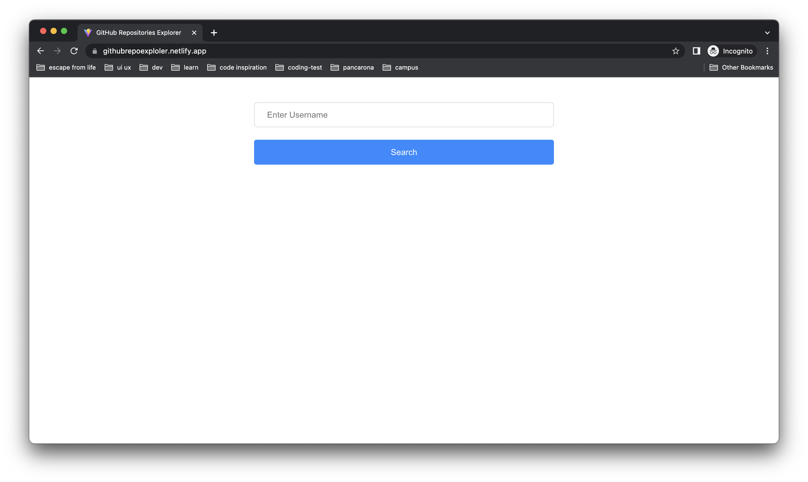
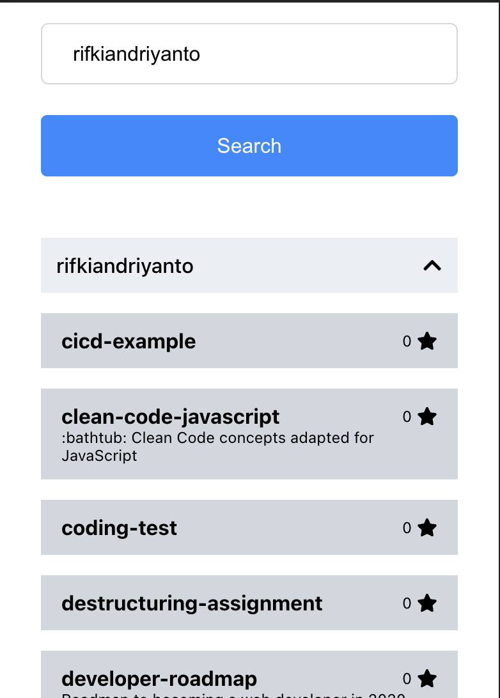

<!-- -- -- -- -- -- -- -- -- -- -- -- -- -- -- -- -- -- -- -- -- -- -- -->
# Github Repositories Exploler
github repositories explorer, a github repository search application using the username for the search

 

<!-- -- -- -- -- -- -- -- -- -- -- -- -- -- -- -- -- -- -- -- -- -- -- -->

## Development

- [x] React
- [x] Vite
- [x] TypeScript

 

<!-- -- -- -- -- -- -- -- -- -- -- -- -- -- -- -- -- -- -- -- -- -- -- -->

## Demo

[Demo Link](https://githubrepoexploler.netlify.app/)

<!-- -- -- -- -- -- -- -- -- -- -- -- -- -- -- -- -- -- -- -- -- -- -- -->